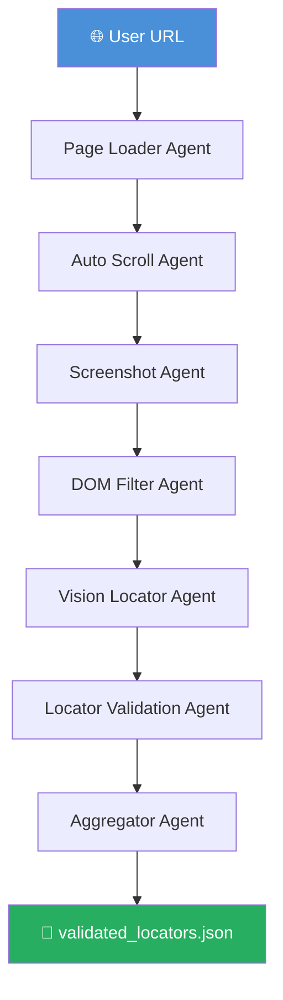

# 🔍 LocatorMadeEasyByAB

<p align="center">
  
  
  
  
</p>

<p align="center">
  <b>AI-powered UI locator discovery for automation testing.</b><br/>
  Give it a URL. Get back ranked, validated, automation-ready CSS locators.
</p>

---

## 📖 Project Description

### The Problem

In modern UI test automation, one of the most time-consuming and frustrating tasks is **finding stable locators** — the CSS selectors, XPaths, or Playwright queries used to identify elements on a webpage. Engineers typically do this manually: open DevTools, inspect elements one by one, copy selectors, paste them into test scripts, and then watch them break the moment the UI changes.

The core issues with this manual approach are:

- **It's slow** — inspecting 20–30 elements per page across dozens of pages adds up to hours of repetitive work
- **It's brittle** — class names like `.btn-primary-v2` or positional selectors like `div:nth-child(3)` break with every UI update
- **It's inconsistent** — different engineers make different selector choices, leading to a fragile, unmaintainable test suite
- **It requires domain knowledge** — knowing that `data-testid` is more stable than a CSS class requires QA experience that junior engineers often lack

> 💡 Studies show that **up to 30% of test maintenance time** is spent fixing broken locators — time that could be spent writing new tests or shipping features.

---

### The Solution

**LocatorMadeEasyByAB** automates the entire locator discovery process using a multi-agent AI pipeline. Instead of a human manually inspecting the DOM, the system:

- Uses a **real browser** (not a static HTML fetcher) so JavaScript-rendered content is fully loaded
- Combines **two sources of context** — the raw HTML snippet AND a full-page visual screenshot — so the AI understands both the structure and the appearance of each element
- Applies **QA engineering best practices automatically**, preferring `data-testid` and `aria` attributes over fragile class names, just as a senior automation engineer would
- **Validates every generated locator** against the live page before surfacing it, so you never get a selector that doesn't work
- Produces a **reliability score** per locator based on selector stability and uniqueness, so you always know which locators to trust

---

### Before vs After

**Without LocatorMadeEasyByAB** — a typical engineer's workflow:

```
1. Open browser DevTools          ← manual
2. Hover over each element        ← manual, per element
3. Copy the auto-generated selector (often fragile class names)
4. Paste into test script
5. Run test — locator fails        ← .btn-v3 was renamed to .btn-v4
6. Go back to step 1               ← repeat for every UI change
```

**With LocatorMadeEasyByAB:**

```
1. Run: python main.py
2. Enter URL
3. Get validated_locators.json    ← done
   → Ranked by reliability score
   → CSS + XPath + Playwright locators
   → Tested against the live page
```

---

### How the AI Reasoning Works

The core intelligence lives in the **Vision Locator Agent**. For each interactive element found on the page, the agent sends two things to GPT-4 vision simultaneously:

1. **The raw HTML snippet** of the element — giving the model structural context (attributes, tag type, name, aria labels)
2. **The full-page screenshot** — giving the model visual context (where is this element on the page, what does it look like, what's around it)

The model is prompted to act as a *senior QA automation engineer* and generate the most stable possible locator, following the same reasoning a human expert would:

```
"This element has an aria-label and a name attribute.
 The aria-label is specific and unlikely to change.
 Prefer: a[aria-label='Gmail '] over a.gb_A.gb_d"
```

This dual-context reasoning is what separates this tool from simple DOM scrapers — it understands *intent*, not just structure.

---

### Locator Types Generated

For every element, the pipeline generates three locator formats so you can use whichever fits your test framework:

| Format | Example | Use With |
|---|---|---|
| **CSS Selector** | `#APjFqb` | Selenium, Cypress, Playwright |
| **XPath** | `//textarea[@id='APjFqb']` | Selenium, Appium |
| **Playwright Locator** | `page.locator('#APjFqb')` | Playwright directly |

---

### Who Is This For?

| Role | How it helps |
|---|---|
| **QA Engineers** | Eliminates manual selector hunting; get a ranked list in seconds |
| **SDET / Automation Engineers** | Jumpstart test script development with pre-validated locators |
| **Developers writing their own tests** | No need to know locator best practices — the AI applies them |
| **Teams onboarding to test automation** | Lower the barrier for engineers new to selector strategies |
| **CI/CD pipelines** | Automate locator refresh when UI changes are deployed |

---

### Limitations & Known Constraints

Being transparent about what this tool is and isn't:

| Limitation | Detail |
|---|---|
| **Requires OpenAI API access** | GPT-4.1-mini vision calls cost tokens; processing 50 elements per page is typical |
| **Public pages only** | Pages requiring login or session tokens are not supported out of the box |
| **Element cap of 50** | The vision agent processes up to 50 elements per run to control token usage |
| **Dynamic SPAs** | Elements rendered after user interaction (modals, dropdowns) won't be captured |
| **Locator freshness** | Generated locators reflect the page at the time of the run; UI changes will require a re-run |

---

### What Makes It Different

Unlike browser extensions or simple CSS extractors, LocatorMadeEasyByAB reasons about locators the way an experienced QA engineer would — weighing selector type, uniqueness, and visual context together. It doesn't just find elements; it finds the *right* locators and tells you how much to trust each one.

> **This project is also a practical demonstration of agentic AI architecture** — showing how a complex multi-step task can be decomposed into focused, independently testable agents connected through a shared state pipeline.

---

## 📌 What It Does

Writing stable UI locators for test automation is tedious and brittle. **LocatorMadeEasyByAB** eliminates that by combining browser automation, DOM parsing, and GPT-4 vision reasoning into a single pipeline that:

1. Loads any webpage using a real headless Chromium browser
2. Scrolls to trigger lazy-loaded content
3. Captures a full-page screenshot
4. Extracts all interactive elements from the DOM
5. Uses GPT-4 vision to generate CSS, XPath, and Playwright locators
6. Validates every locator against the live page
7. Scores and ranks results by reliability

The output is a structured JSON file of **ready-to-use, confidence-ranked automation locators**.

---

## 🏗️ Architecture

The system is built on an **agent pipeline** pattern. Each agent is a focused, independently testable unit that reads from and writes to a shared state dictionary.



| Agent | Responsibility |
|---|---|
| **Page Loader** | Launches Chromium, navigates to URL, captures rendered HTML |
| **Auto Scroll** | Scrolls page incrementally to trigger lazy-loaded content |
| **Screenshot** | Takes a full-page PNG screenshot for visual context |
| **DOM Filter** | Parses HTML with BeautifulSoup, extracts interactive elements |
| **Vision Locator** | Sends element HTML + screenshot to GPT-4 vision; generates locators |
| **Validation** | Tests each locator against the live page; scores stability & uniqueness |
| **Aggregator** | Sorts by reliability score and writes output to JSON |

---

## 📊 Locator Scoring

Each locator is scored across two dimensions and combined into a final **reliability score**:

### Stability Score — *How robust is the selector type?*

| Selector Type | Score | Reason |
|---|---|---|
| `#id` | 1.00 | IDs are unique by design, rarely change |
| `data-testid` | 0.95 | Purpose-built for automation |
| `[name=]` | 0.90 | Form field names are stable |
| `[aria-*]` | 0.85 | Accessibility attributes are semantically stable |
| `[placeholder]` | 0.85 | Stable but can change with copy updates |
| `text` | 0.80 | Readable but brittle to content changes |
| Other | 0.60 | Class names, generic selectors |

### Uniqueness Score — *How precisely does it target one element?*

| Matches on Page | Score |
|---|---|
| 1 (perfect) | 1.00 |
| 2–3 (ambiguous) | 0.60 |
| 4+ (too generic) | 0.30 |

**`reliability_score = stability × uniqueness`**

---

## 📦 Sample Output

```json
[
  {
    "element_name": "search_textarea",
    "element_type": "textarea",
    "css_locator": "#APjFqb",
    "xpath_locator": "//textarea[@id='APjFqb']",
    "playwright_locator": "page.locator('#APjFqb')",
    "valid": true,
    "matches": 1,
    "stability_score": 1.0,
    "reliability_score": 1.0
  },
  {
    "element_name": "gmail_link",
    "element_type": "link",
    "css_locator": "a[aria-label='Gmail ']",
    "xpath_locator": "//a[@aria-label='Gmail ']",
    "playwright_locator": "page.locator('a[aria-label=\"Gmail \"]')",
    "valid": true,
    "matches": 1,
    "stability_score": 0.85,
    "reliability_score": 0.85
  }
]
```

---

## 🚀 Getting Started

### Prerequisites

- Python 3.10+
- An OpenAI API key (GPT-4.1 vision access required)

### Installation

```bash
# 1. Clone the repository
git clone https://github.com/your-username/LocatorMadeEasyByAB.git
cd LocatorMadeEasyByAB

# 2. Install Python dependencies
pip install -r requirements.txt

# 3. Install Playwright browser binaries
playwright install chromium

# 4. Set up your environment variables
cp .env.example .env
# Edit .env and add your OPENAI_API_KEY
```

### Environment Setup

Create a `.env` file in the project root:

```env
OPENAI_API_KEY=sk-your-api-key-here
```

### Run

```bash
python main.py
```

You will be prompted to enter a URL:

```
Enter webpage URL: https://google.com

[2024-01-15 10:23:45] | INFO | [AGENT START] Page Loader Agent
[2024-01-15 10:23:47] | INFO | [AGENT END] Page Loader Agent (2.14s)
...

✅ Pipeline completed

Top Locator Candidates:

search_textarea → #APjFqb (score=1.0)
gmail_link → a[aria-label='Gmail '] (score=0.85)
images_link → a[aria-label='Search for Images '] (score=0.85)

📁 Results saved to validated_locators.json
```

---

## 📁 Project Structure

```
LocatorMadeEasyByAB/
│
├── main.py                     # Pipeline orchestrator & entry point
├── state_schema.py             # Shared state schema factory
├── requirements.txt            # Python dependencies
├── .env                        # API keys (not committed)
│
├── agents/
│   ├── page_loader_agent.py    # Step 1: Load page DOM
│   ├── scroll_agent.py         # Step 2: Scroll for lazy content
│   ├── screenshot_agent.py     # Step 3: Capture full-page screenshot
│   ├── filter_agent.py         # Step 4: Extract interactive elements
│   ├── vision_locator_agent.py # Step 5: AI-powered locator generation
│   ├── validation_agent.py     # Step 6: Live validation & scoring
│   └── aggregator_agent.py     # Step 7: Save ranked output
│
├── utils/
│   ├── logger.py               # Shared logger configuration
│   └── agent_decorator.py      # @agent decorator for logging & timing
│
├── prompts/
│   └── vision_locator_prompt.py # GPT-4 prompt builder
│
├── debug/
│   ├── dom.html                # Captured DOM (auto-generated)
│   └── page.png                # Full-page screenshot (auto-generated)
│
└── validated_locators.json     # Final output (auto-generated)
```

---

## 🔧 Key Design Patterns

**Pipeline architecture** — agents are chained in a list and executed sequentially. Adding, removing, or reordering a step is a one-line change in `main.py`.

**Shared mutable state** — a single dictionary flows through every agent. Each agent enriches it rather than returning isolated results, making inter-agent data sharing trivial.

**`@agent` decorator** — any function decorated with `@agent("Name")` automatically gets start/end logging and execution timing, keeping agent business logic clean.

**Fail-fast error handling** — a `try/except` wraps each agent call. A single failure stops the pipeline immediately with a clear error message, preventing silent cascading failures.

---

## ⚙️ Tech Stack

| Layer | Technology |
|---|---|
| Browser Automation | [Playwright](https://playwright.dev/python/) |
| HTML Parsing | [BeautifulSoup4](https://www.crummy.com/software/BeautifulSoup/) |
| AI Vision | [OpenAI GPT-4.1-mini](https://platform.openai.com/docs/) |
| Logging | Python `logging` module |
| Environment | `python-dotenv` |

---

## 🤝 Contributing

Contributions are welcome! Feel free to open issues or submit pull requests for:

- Support for additional locator types (XPath-only, Playwright roles)
- Parallel processing of elements to reduce runtime
- A web UI or CLI with richer output formatting
- Support for authenticated pages

---

## 👤 Author

**Venkateshwara Doijode**

---

## ⭐ Support

If you find this project useful, please consider giving it a star — it helps others discover it!